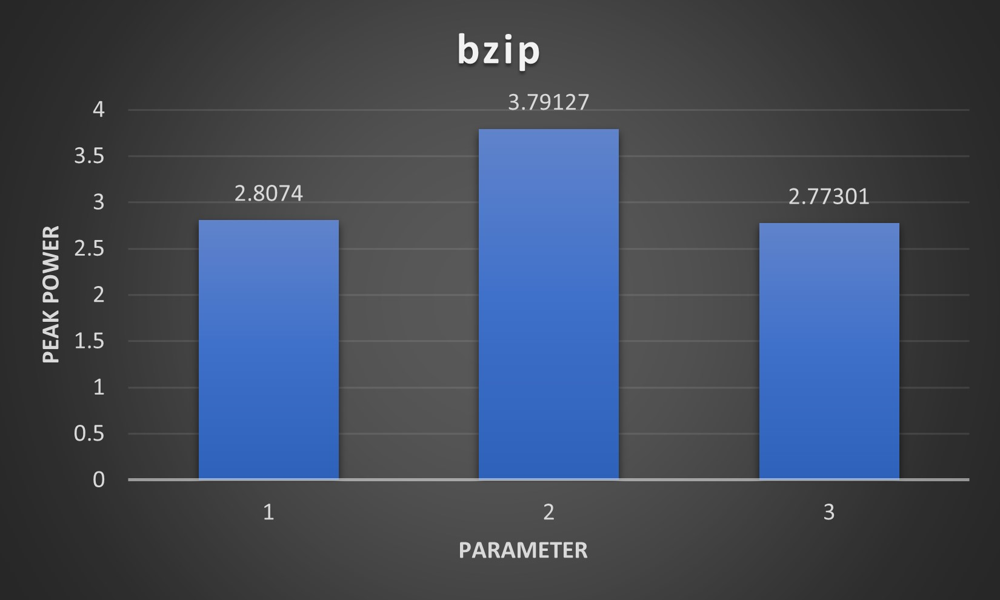
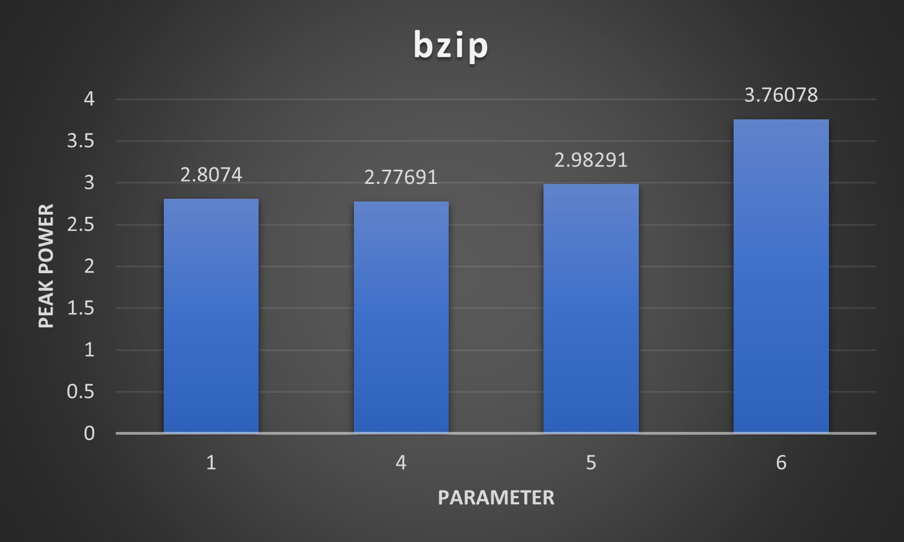
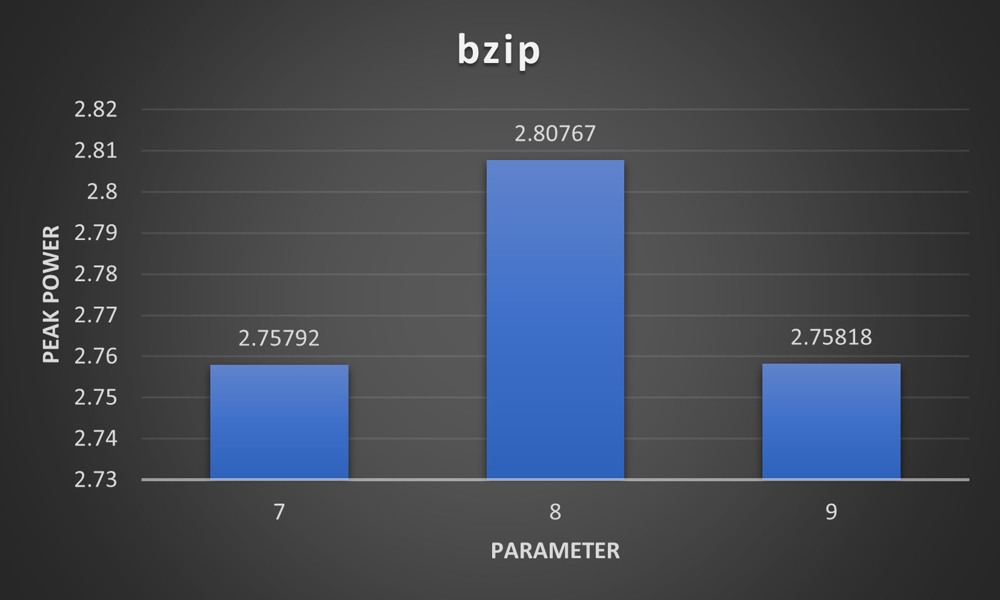
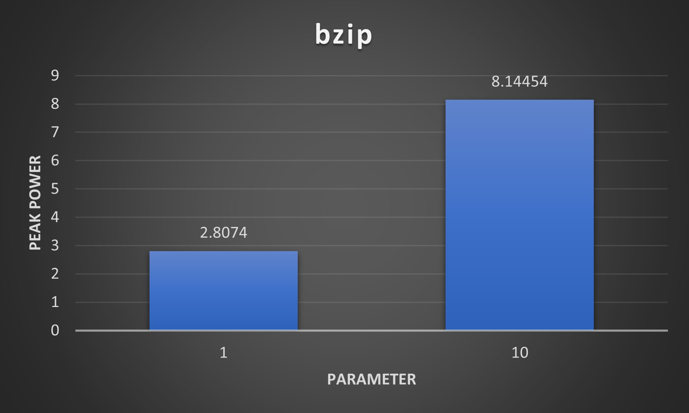

# auth-computer-arch-lab-ex3

**Lab 3**

*Tsirakis Orestis (9995)*

*Iliana Kogia (10090)*

---

**Part 1**

---

1.

Power dissipation in a circuit is dynamic or static. 

As static and dynamic power are additives, each needs to be considered independently. Static power, which is also defined as “leakage,” is consumed in the absence of any design activity. It is highly associated with the current flowing through the transistor in idle state determined by the transistor attributes. Dynamic power is associated with the activity in the design influenced by the volume of data that the design has to process in a given time unit by switching the transistors between on and off states.

If two different programms run on the same CPU individually, as there is no power gating applied, only the dynamic power will be affected. The program that results in a higher dynamic power consumption is the program with the most flip-flop state changes. If power gating is applied, when the program is running the operating temperatute rises and increases the leakage power loss, so the static power can be affected depending on the usage of the processor.

Because McPAT generates consumption numbers that refer to power and not power consumption per hour, time duration does not matter.

2.

Energy efficiency is given by the formula: ef = (idle consumption * idle time) + (work consumption * work time). So there is a chance that the second processor is more energy efficient, as we dont know the work and idle times. McPAT can't give us a clear view of energy efficiency as these time parameters are not given in the results. We can get access to these parameters by a gem5 simulation.

3.

Xeon -> 50 times faster than A9

Xeon: Processor.Peak Power = 134.938 W

A9: Processor.Peak Power = 1.74189 W

Let's say the program on Xeon runs in 1 hour, so the Xeon CPU consumes 140x1=140Wh on full work state. From the assignment we get that the program on A9 will be 50 times slower and it will run in 50 hours, so the A9 CPU consumes 1.7*50=85Wh on full work state. So, even if the CPU goes off after finishing the program, it's clear that the A9 is more energy efficient than the Xeon as it consumes less Wh to complete the execution. If the CPU stays on idle after the execution, the Xeon processor will consume even more energy due to static power (leakage). In conclusion, the A9 processor is more energy efficient than the Xeon, even though the later is much faster on executing the program.

---

**Part 2**

---

1.

**EDAP = Energy x Delay x Area**, Where:

Energy: Total energy = Core.Subthreshold Leakage + Core.Gate Leakage + Core.Runtime Dynamic + L2.Subthreshold Leakage + L2.Gate Leakage + L2.Runtime Dynamic.

Delay: Total delay = the execution time of the program

Area: Total area = Core.Area + L2.Area

Energy consumption values using the EDAP function:

| Set Parameter | 1 | 2 | 3 | 4 | 5 | 6 | 7 | 8 | 9 | 10 |
| --- | --- | --- | --- | --- | --- | --- | --- | --- | --- | --- |
| L1\_d | 32kB | 16kB | 16kB | 32kB | 32kB | 16kB | 32kB | 32kB | 32kB | 32kB |
| L1\_i | 32kB | 64kB | 16kB | 32kB | 32kB | 64kB | 32kB | 32kB | 32kB | 32kB |
| L2 | 512kB | 512kB | 512kB | 256kB | 2MB | 256kB | 512kB | 512kB | 512kB | 512kB |
| L1\_i\_assoc | 2 | 2 | 2 | 2 | 2 | 2 | 1 | 2 | 1 | 2 |
| L1\_d\_assoc | 2 | 2 | 2 | 2 | 2 | 2 | 1 | 2 | 1 | 2 |
| L2\_assoc | 2 | 2 | 2 | 2 | 2 | 2 | 2 | 4 | 4 | 2 |
| Cache line | 64 | 64 | 64 | 64 | 64 | 64 | 64 | 64 | 64 | 128 |

2.

**{1, 2, 3}**

**{1, 4, 5, 6}**

**{7, 8, 9}**

**{1, 10}**

